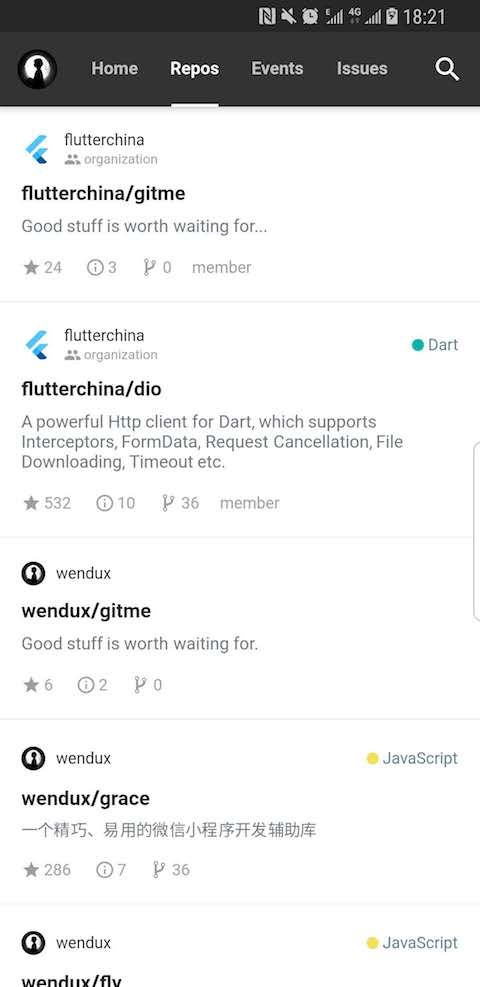
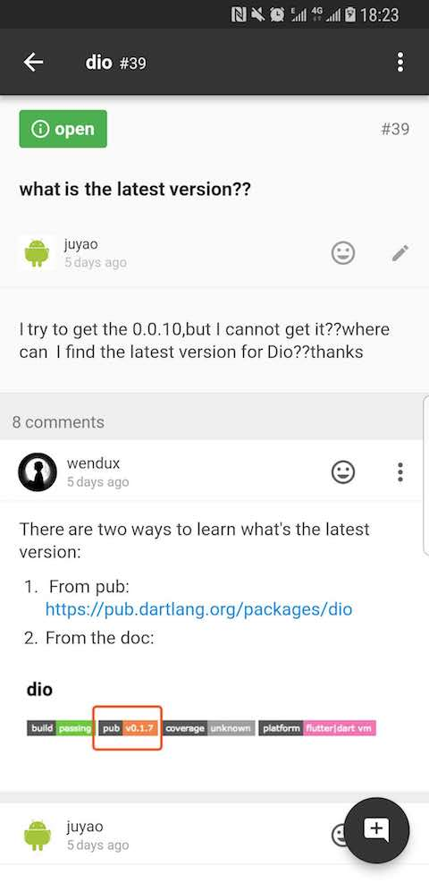
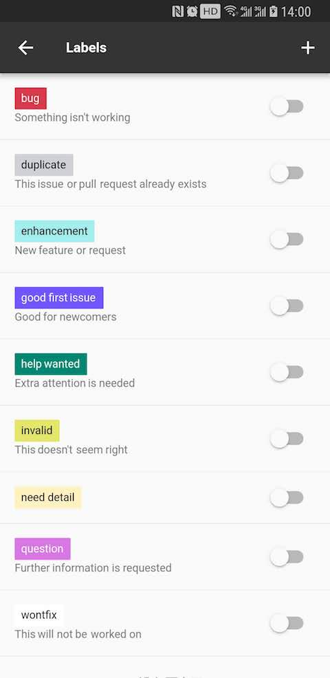
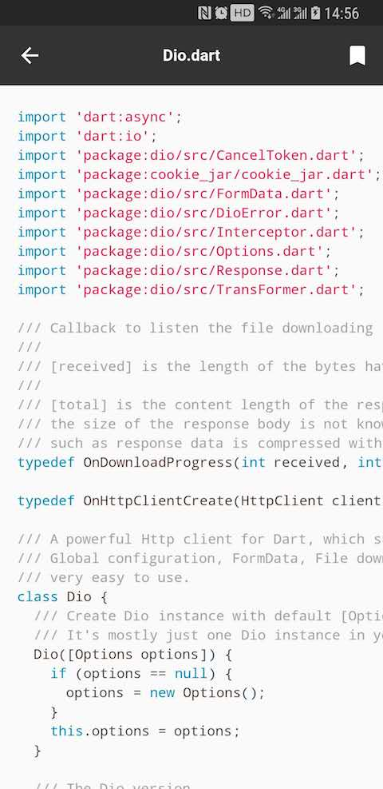
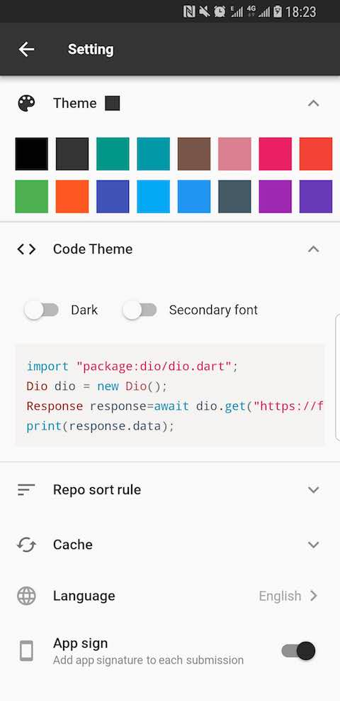

[中文简体](./README-CHS.md)|[English](./README.md)

## 一个坏消息

由于笔者最近换了一次电脑，文件迁移时漏了一部分数据，今天打算整理一下代码开源时，发现源码找不到了。

之前Gitme一直没有开源的原因有两个，一是我平时工作太忙，二是业余时间参与的开源项目太多，实在有些顾不过来。当时做Gitme的初衷是为了让对Flutter这门新技术有所徘徊的开发者在决定学习Flutter之前能看到一个纯Flutter开发的案例(那时国内没有一个纯Flutter应用)，直观的感受Flutter应用的性能和跨平台是否如官方所宣称的那样好。而今天，flutter的成功案例已经很多了，Gitme这个作用已经不强了。但是Gitme的发布有了一个附带的结果，就是目前有近6000人使用它做为Github客户端，那么现在有个现实的问题就是Gitme到底还维不维护？对这个问题我谈谈自己的几点想法：

1. 不维护；不维护的原因主要有两个，一是Gitme虽然还有一些待优化的地方，但是作为Github客户端现在大多数功能已经有了，产品已经稳定了。另一个原因就是我业余时间有限，必须把时间放在优先级较高的事情上，如完成《Flutter实战》一书和维护笔者名下用户较多的几个开源库。

2. 重新创建一个开源项目，大家一起重新将Gitme做起来；幸运的是Gitme的设计稿还在，内部我可以根据之前的经验搭一个框架，但是我目前没有经历来主导这件事。所以需要几个核心开发人员来推动，如果没有主导的人，这个事肯定做不成。如果大家觉得有必要，并且也想借此机会学习一下Flutter，那么可以在Issue中请愿留言或联系我。这件事如果做成，那么所有参与的开发者们都可以使用自己写的APP来访问Github，大家可以群策群力，也许在协作的过程中，大家可以建立起坚固革命友谊。

不管最终Gitme是否会复活，请大家客观看待，代码没有保护好是我们的责任。但归根结底，还是人力问题，中文网社区有很多事要做，而几乎所有用户都是都是社区内容的用户，参与生产的人太少，组织成员们也都是挺辛苦，牺牲自己业余时间，不为虚名，踏实做实事，都是抱着对技术的热情，只求能真正把Flutter介绍给中国开发者。

最后，欢迎志同道合、对技术充满热情的同学加入我们创作团队。

Gitme

Gitme is a powerful github client APP which is developed by [flutterchina club](https://flutterchina.club) with [Flutter](https://flutter.io) 。

The Official download address:  https://flutterchina.club/app/gm.html 

Or scan this QR-Code to download:

## Screenshots

